# **Customer service bot using RAG**

This is a portfolio project to demonstrate how a RAG customer support bot works.

For this demo I generated sample policy documents and chat logs for an insurance  company "Veltora Insurance". However, In your session you can remove these sample documents and add your own documents to test the system.

## Things to note before you try

* Please don't upload any sensitive document
* This runs on generous free tiers of several providers, so please keep the documents and chat sessions small. For detailed demo please reach out to me

> [!Important]
> **Note:** Because this demo has no user authentication, documents used in chat sessions are stored only temporarily and are deleted every hour. This limits how long any conversation data is retained.

## Link to project

### [Knowledge bot | Ramasubramanian](https://knowledgebot.ramasubramanian.me/)

## Stack

### **Model**

### **Backend**

### **Frontend**

### **Database**

### **Hosting**

## Architecture

```mermaid
---
config:
  theme: mc
  themeVariables:
    fontSize: 20px
  layout: fixed
---
flowchart LR
    U["`**User**`"] --> FE["`**React frontend**<br>Vercel`"]
    FE -- upload document via signed URL --> ST[("`**Supabase Storage**`")]
    FE <-- chat and upload <br>requests --> API["`**FastAPI backend**`"]
    API L_API_LLM_0@-- chunk and embed --> LLM(["`**Gemini 3.6 Flash API**`"])
    API L_API_DB_0@-- store chunks and vectors --> DB[("`**Supabase Postgres<br>pgvector**`")]
    API L_API_DB_2@<-- similarity search --> DB
    API L_API_LLM_2@<-- generate answer --> LLM
    ST L_ST_API_0@<--> API
    ST -- Clear session data every hour --> n1["`**Supabase edge function**`"]

    U@{ shape: text}
    n1@{ shape: rect}
     U:::userNode
     FE:::frontend
     ST:::storage
     API:::backend
     LLM:::llm
     DB:::Pine
    classDef userNode stroke:#818cf8,fill:#eef2ff
    classDef frontend stroke:#38bdf8,fill:#f0f9ff
    classDef backend stroke:#a78bfa,fill:#f5f3ff
    classDef storage stroke:#2dd4bf,fill:#f0fdfa
    classDef llm stroke:#fb923c,fill:#fff7ed
    classDef worker stroke:#e879f9,fill:#fdf4ff
    classDef Pine stroke-width:1px, stroke-dasharray:none, stroke:#254336, fill:#27654A, color:#FFFFFF
    style U fill:#000000,color:#ffffff
    style FE fill:#38bdf8,stroke-width:4px,stroke-dasharray: 0,color:#ffffff,stroke:#000000
    style ST stroke-width:4px,stroke-dasharray: 0,stroke:#000000,fill:#27654A,color:#ffffff
    style API fill:#2dd4bf,stroke-width:4px,stroke-dasharray: 0,stroke:#000000,color:#ffffff
    style LLM stroke-width:4px,stroke-dasharray: 0,fill:#FF6D00,color:#ffffff
    style DB stroke:#000000,fill:#27654A,stroke-width:4px,stroke-dasharray: 0
    style n1 stroke-width:4px,stroke-dasharray: 0,fill:#27654A,color:#ffffff,stroke:#000000

    L_API_LLM_0@{ curve: linear } 
    L_API_DB_0@{ curve: linear } 
    L_API_DB_2@{ curve: linear } 
    L_API_LLM_2@{ curve: linear } 
    L_ST_API_0@{ curve: linear }
```

## Why RAG?

RAG is used to make an LLm answer questions using relevant external or private information, rather than relying only on what was in its training data.

RAG also gives developers firmer control over what information the model draws on, since they decide which documents are retrieved and supplied to it.

## Production Improvement

This project demonstrates a RAG pipeline for a customer service bot, so some parts are intentionally kept simple. In a production system, I would add the following:

* Document specific chunking
* Hybrid search for retrieving more relevant context
* Retrieve a larger set of candidate and use a system one model like jev to re-rank to keep relevant context
* Add tests to check FAQ. Separately test retrieval and answers to make sure Model and RAG pipeline
* Add citations to model answers whenever necessary
* Remove personal, health and other confidential information from files before embedding them.
* Build a separate job queue to chunk and store new chat logs and documents so as to not crowd chatbot's server

## Links

